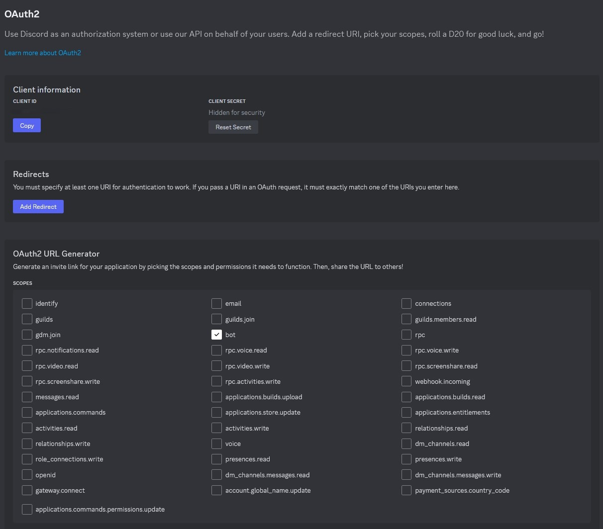
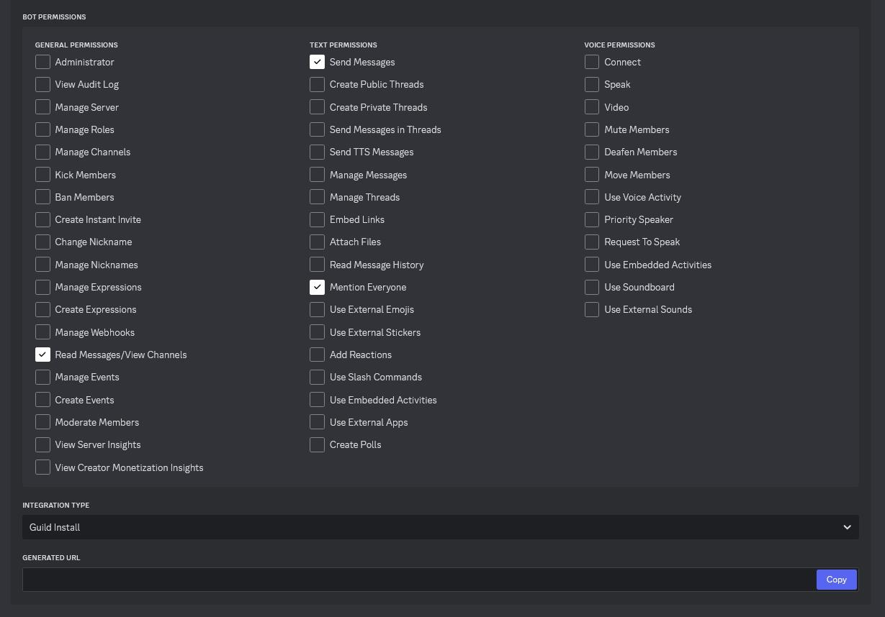
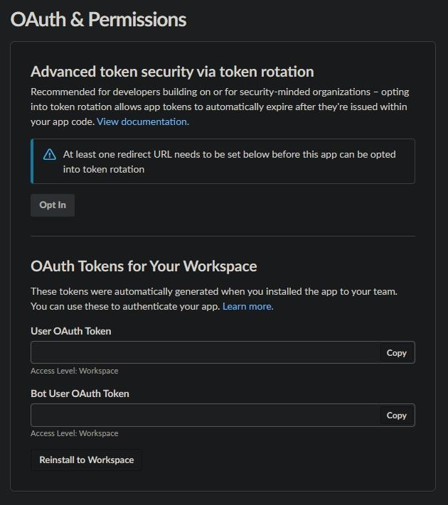
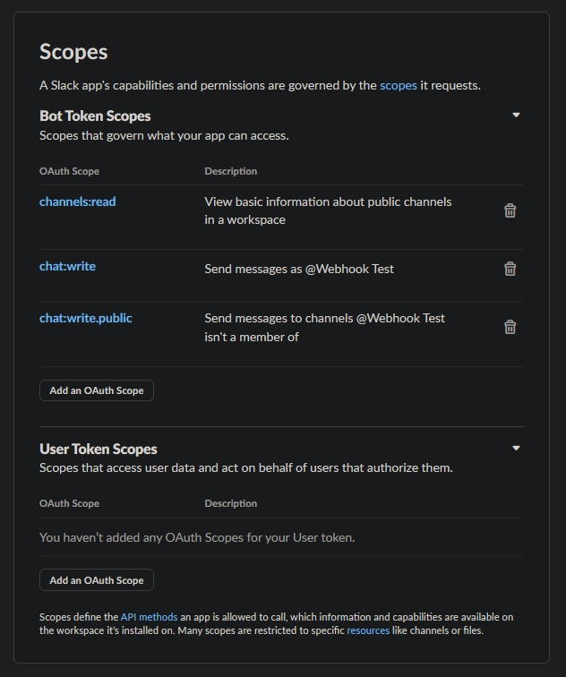
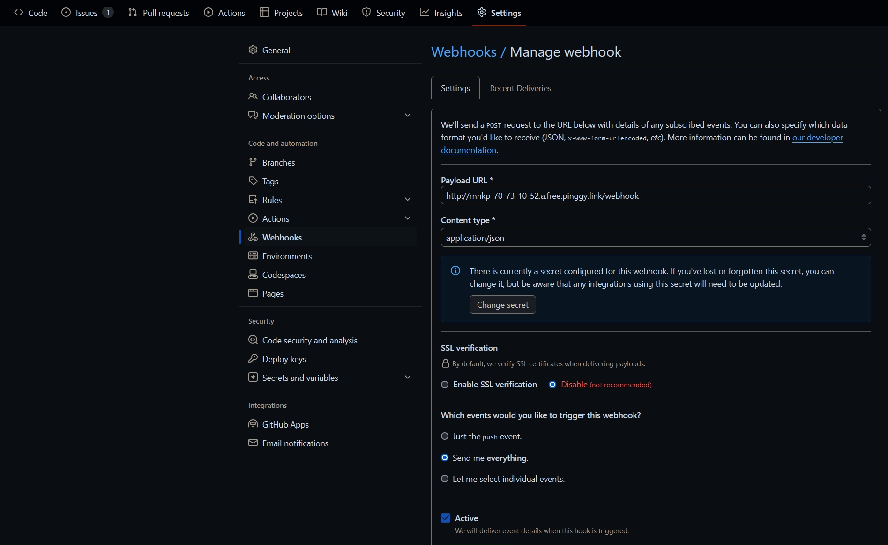
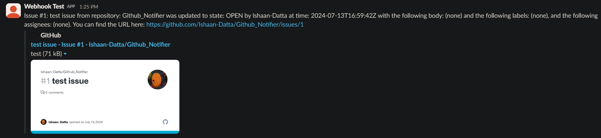

# Github_Notifier

## Introduction

This project is a webhook event handler that integrates with Discord, Slack, and GitHub. It processes webhook events from GitHub, sends messages to Discord and Slack channels, and handles GitHub GraphQL API queries to fetch additional details about issues and pull requests. The project is written in Go and leverages various APIs to facilitate communication between the services.

## Setup:
#### Prerequisites:
    
    Go (1.16 or later)
    GitHub, Discord, and Slack accounts with the necessary permissions
    Configuration file (config.json)

#### Configuration:
Create a config.json file in the root directory of your project with the following structure:

    {
        "discord_bot_token": "YOUR_DISCORD_BOT_TOKEN",
        "discord_channel_id": "YOUR_DISCORD_CHANNEL_ID",
        "github_oauth_token": "YOUR_GITHUB_OAUTH_TOKEN",
        "slack_channel_id": "YOUR_SLACK_CHANNEL_ID",
        "slack_oauth_token": "YOUR_SLACK_OAUTH_TOKEN"
    }

Replace YOUR_DISCORD_BOT_TOKEN, YOUR_DISCORD_CHANNEL_ID, YOUR_GITHUB_OAUTH_TOKEN, YOUR_SLACK_CHANNEL_ID, and YOUR_SLACK_OAUTH_TOKEN with your actual tokens and IDs.

Adding Discord Bot Token:

 1. Go to the Discord Developer Portal and create a new application.
 2. Navigate to the "Bot" section and click "Add Bot".
 3. Under the "TOKEN" section, click "Copy" to copy your bot token.
 4. Paste the copied token into the discord_bot_token field in your config.json file.

 
 

Adding Slack Token

 1. Go to the Slack API: Applications and create a new application.
 2. Navigate to the "OAuth & Permissions" section and add the necessary scopes for your bot.
 3. Install the app to your workspace.
 4. Copy the "OAuth Access Token" and paste it into the slack_oauth_token field in your config.json file.
 5. Obtain the Slack channel ID where you want to post messages and add it to the slack_channel_id field in your config.json file.

 
 

### Installation

 Clone the repository:
 
    git clone https://github.com/yourusername/webhook-event-handler.git
    cd webhook-event-handler

 Install dependencies:
 
    go mod tidy

 Build the project:
 
    go build -o webhook-handler

## Usage

Start the server by running the following command:

    go run main.go

Setting Up Local Endpoint for Testing

 1. To create a local endpoint that can be accessed from the internet for testing purposes, you can use Pinggy:
 2. Sign up for a Pinggy account and install the Pinggy CLI.
 3. Run the following command to set up a local endpoint:

        ssh -p 443 -L4300:localhost:4300 -R0:localhost:3000 a.pinggy.io

  This command creates a local endpoint for a 1-hour window. Replace localhost:3000 with the address and port your webhook handler is running on if different.

Setting up Github Webhook:

 1. Navigate to your GitHub repository, click on "Settings", and then "Webhooks".
 2. Click on "Add webhook".
 3. In the "Payload URL" field, enter your server's address: http://your-server-address:8080/webhook
 4. Replace http://your-server-address:8080 with your actual server address or the Pinggy URL provided for testing.
 5. Set the "Content type" to application/json.
 6. Select the individual events you want to receive or choose "Send me everything".
 7. Click "Add webhook".

  

## Handling Events

The webhook event handler processes different types of GitHub events and sends notifications to the configured Discord and Slack channels. The supported event types are:

    push
    pull request
    issue
    create
    delete

Example:

 Push Event: When a push event is received, including branch creation or deletion events, the handler constructs a message and sends it to the configured Discord and Slack channels.
 Pull Request Event: For pull request events, the handler queries the GitHub GraphQL API to get additional details and sends the information to the channels.
 Issue Event: Similar to pull request events, issue events are processed by querying the GitHub GraphQL API and sending the details to the channels.

 
 

### Logs

The handler logs the processing of tasks and results. You can view these logs in the terminal where the server is running.

### Error Handling

If there are any errors during the processing of tasks or sending messages, the handler logs the errors and continues processing the next tasks.
