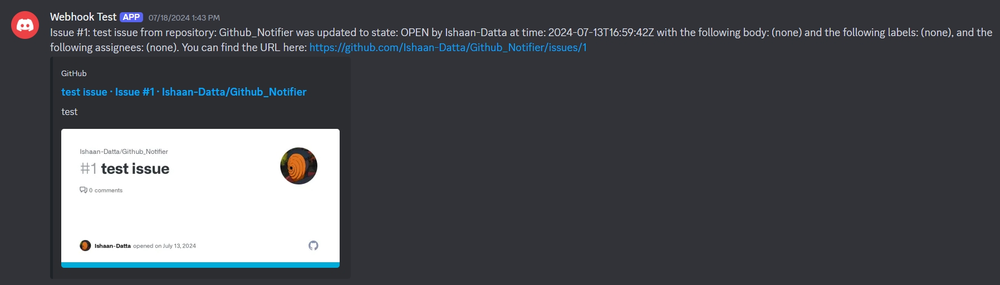

# Github-Notifier

## Application Overview:

This application is a webhook event handler integrating with Discord, Slack, and GitHub. It processes webhook events from GitHub, communicates with Discord and Slack channels, and performs GitHub GraphQL API queries to fetch additional information regarding issues and pull requests. Built in Go, the application efficiently leverages these APIs to facilitate interaction between services.

## Why use it?

This application offers a simplified setup and configuration process that integrates key communication platforms (Discord, Slack) with GitHub for seamless notifications and event handling. With a few simple steps, you can have your webhooks set up and running, making your development workflow more efficient.

## Prerequisites:

To deploy and use the webhook handler, ensure the following requirements are met:

    Go (1.16 or later)
    GitHub, Discord, and Slack accounts with the necessary permissions
    Configuration file (config.json)

## Configuration:

Before starting, create a config.json file in the root directory with the following structure:

    {
        "discord_bot_token": "YOUR_DISCORD_BOT_TOKEN",
        "discord_channel_id": "YOUR_DISCORD_CHANNEL_ID",
        "github_oauth_token": "YOUR_GITHUB_OAUTH_TOKEN",
        "slack_channel_id": "YOUR_SLACK_CHANNEL_ID",
        "slack_oauth_token": "YOUR_SLACK_OAUTH_TOKEN"
    }

Ensure the actual tokens and IDs replace placeholder values.

## Setting up Discord:

Adding Discord Bot Token:

 1. Go to the Discord Developer Portal and create a new application.
 2. Navigate to the "Bot" section and click "Add Bot".
 3. Under the "TOKEN" section, click "Copy" to copy your bot token.
 4. Paste the copied token into the discord_bot_token field in your config.json file.

 
 

## Setting up Slack:

 1. Go to the Slack API: Applications and create a new application.
 2. Navigate to the "OAuth & Permissions" section and add the necessary scopes for your bot.
 3. Install the app to your workspace.
 4. Copy the "OAuth Access Token" and paste it into the slack_oauth_token field in your config.json file.
 5. Obtain the Slack channel ID where you want to post messages and add it to the slack_channel_id field in your config.json file.

 
 

## Installation

  Clone the project repository and navigate to the directory:
 
    git clone https://github.com/yourusername/webhook-event-handler.git
    cd webhook-event-handler

 Install dependencies:
 
    go mod tidy

 Build the project:
 
    go build -o webhook-handler

## Usage

Start the server by running the following command:

    go run main.go

## Testing and Local Endpoint Setup:

For local testing, you can create an endpoint accessible over the internet using Pinggy:

 1. Sign up for a Pinggy account and install the Pinggy CLI.
 2. Run the following command to set up a local endpoint:

        ssh -p 443 -L4300:localhost:4300 -R0:localhost:3000 a.pinggy.io

  This command creates a local endpoint for a 1-hour window.

## Setting up Github Webhook:

To integrate GitHub:

 1. Go to the "Settings" of your GitHub repository, then "Webhooks."
 2. Add the webhook by entering the payload URL in the format: http://your-server-address:8080/webhook.
 3. Select "application/json" as the content type, then choose the events to send.

  

## Event Handling:

The handler supports the following GitHub events:

    push
    pull request
    issue
    create
    delete

Example:

    Push Event: When a push event is received, including branch creation or deletion events, the handler constructs a message and sends it to the configured Discord and Slack channels.
    Pull Request Event: For pull request events, the handler queries the GitHub GraphQL API to get additional details and sends the information to the channels.
    Issue Event: Similar to pull request events, issue events are processed by querying the GitHub GraphQL API and sending the details to the channels.

 
 

## Logs:

You can track webhook activities and events via logs in the terminal where the service runs.

## Error Handling:

If any errors occur during webhook processing or while sending notifications, they will be logged, and the handler will continue processing subsequent events.
